# Battles

## Pilot Battle

[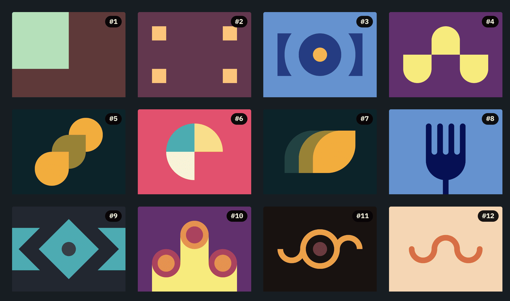](./01-Pilot-Battle)

## Visibility

[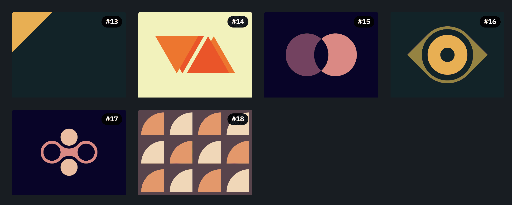](./02-Visibility.md)

## Cursor

## Display

[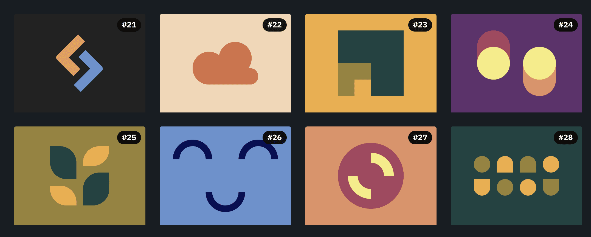](./04-Display.md)

## Inline

## Conic

## Backface

[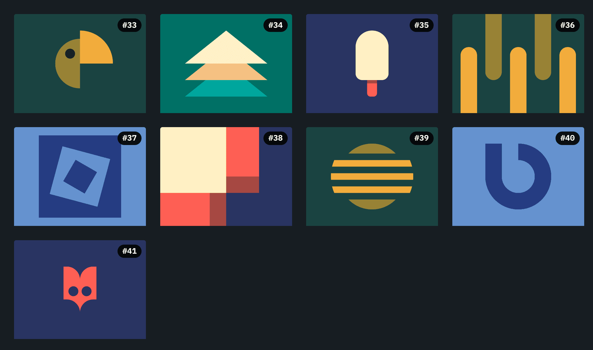](./07-Backface.md)

## Transition

## Margin

## Block

## Overflow

## Blend

[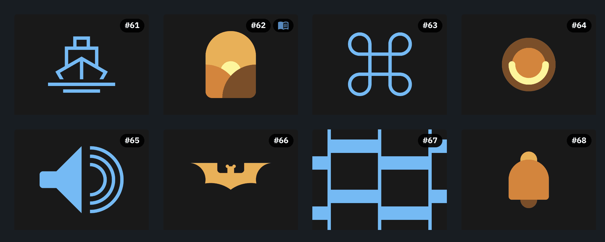](./12-Blend.md)

## Clip

[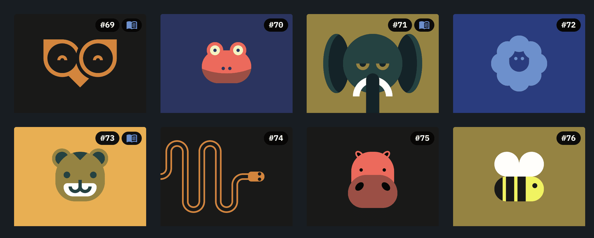](./13-Clip.md)

## Z Index

[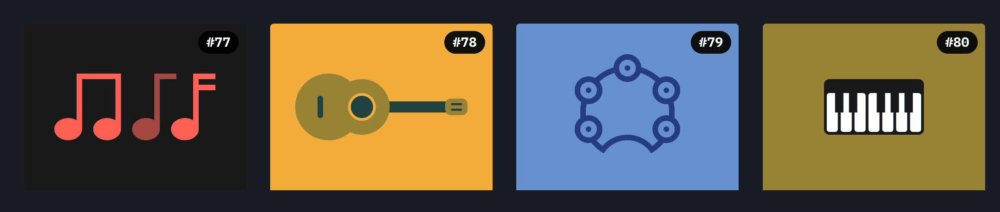](./14-ZIndex.md)

## Filter

[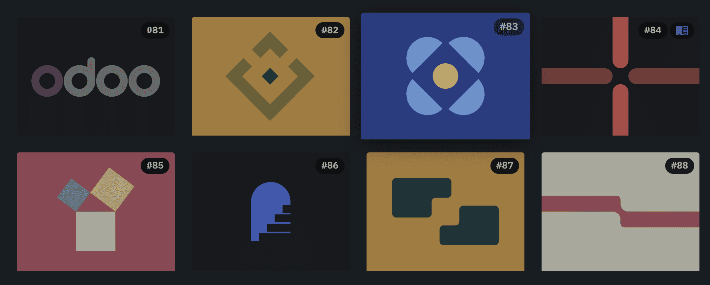](./15-Filter.md)

## Aspect

[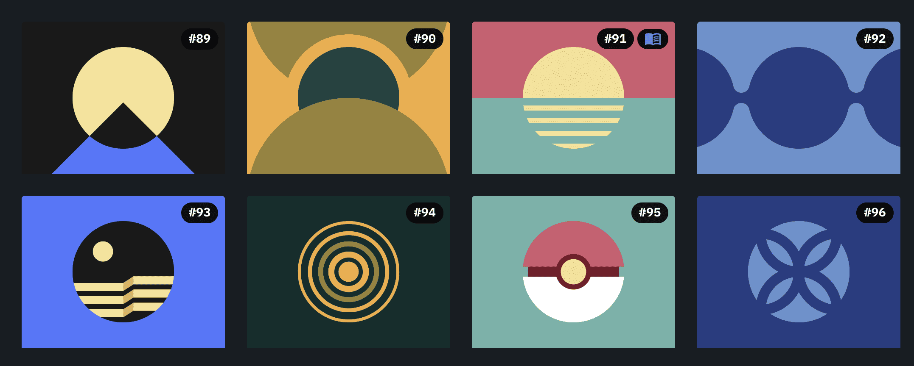](./16-Aspect.md)

## Christmas

[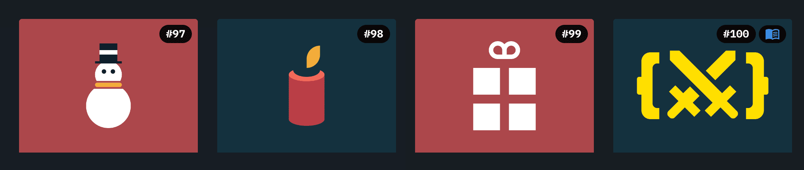](./17-Christmas.md)

## Float

[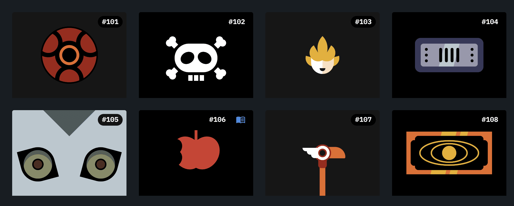](./18-Float.md)

## Spacing

[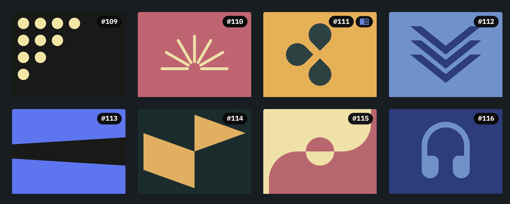](./19-Spacing.md)

## Hover

[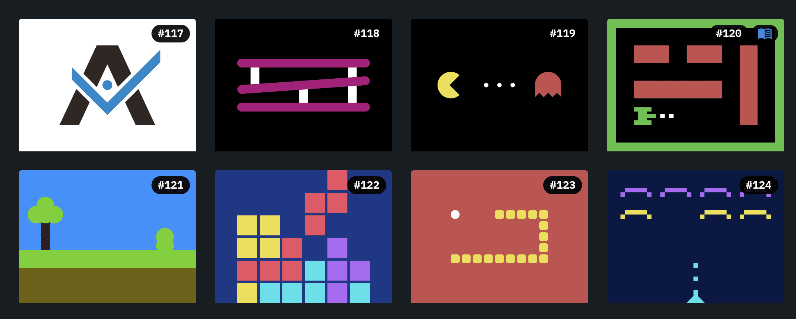](./20-Hover.md)

## Rotate

[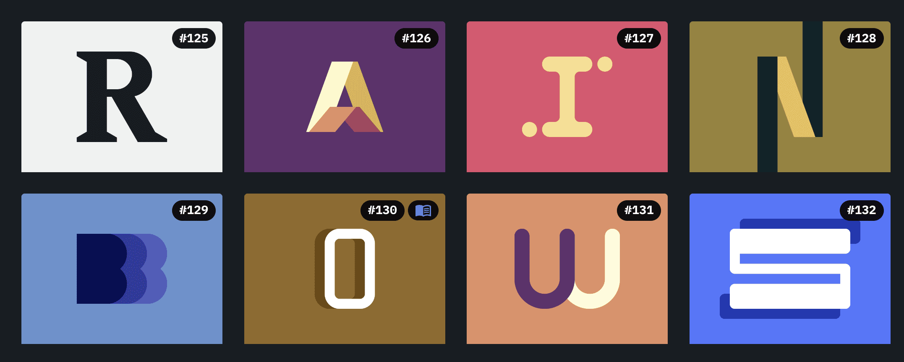](./21-Rotate.md)

## Grid

[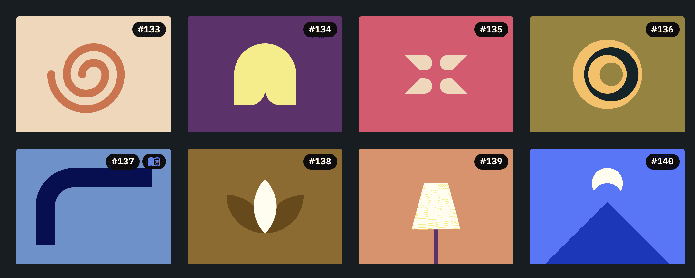](./22-Grid.md)

## Contain

## Offset

[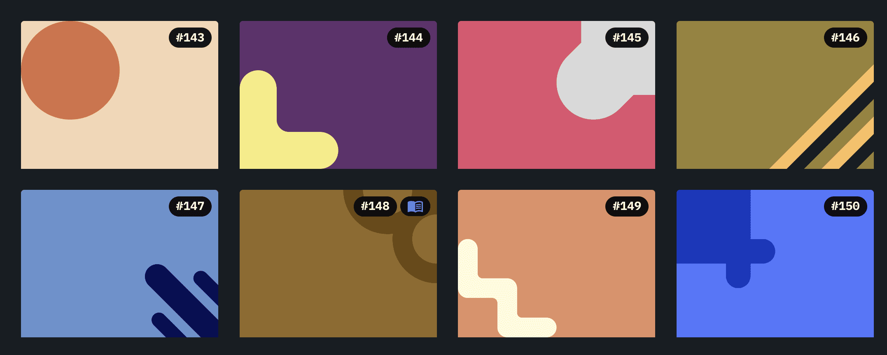](./24-Offset.md)

## Flex

[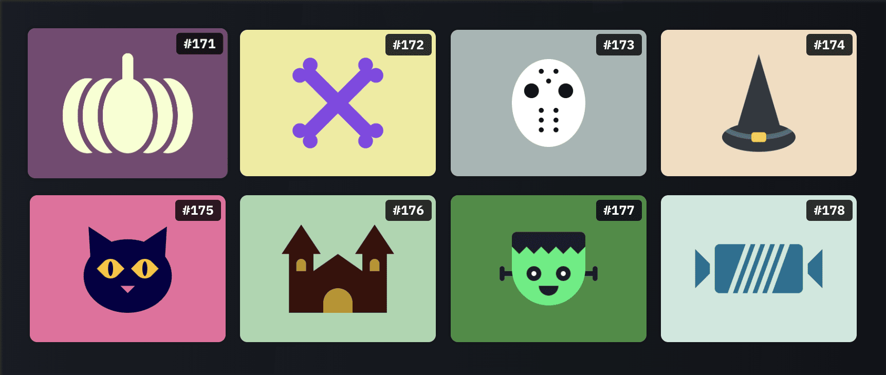](./25-Flex.md)

## Initial

[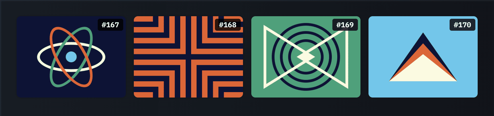](./26-Initial.md)

## Relative

## Revert

